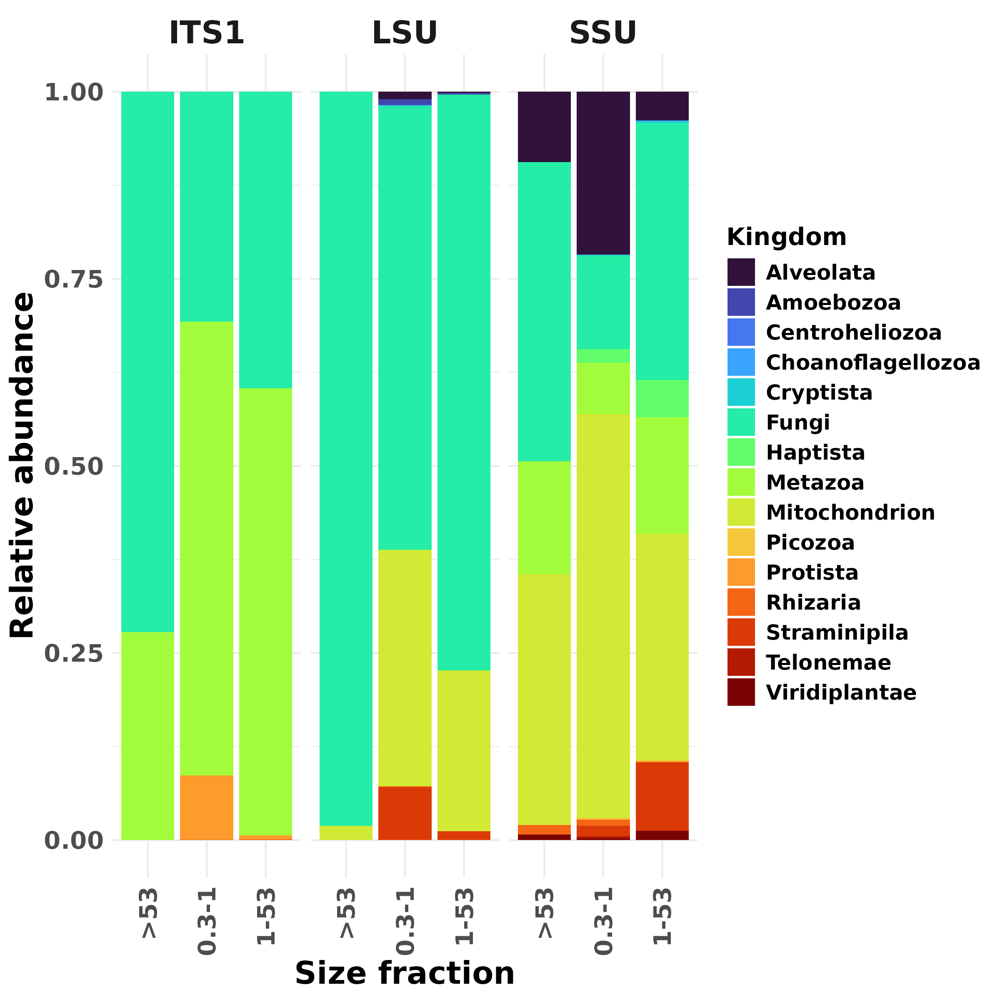
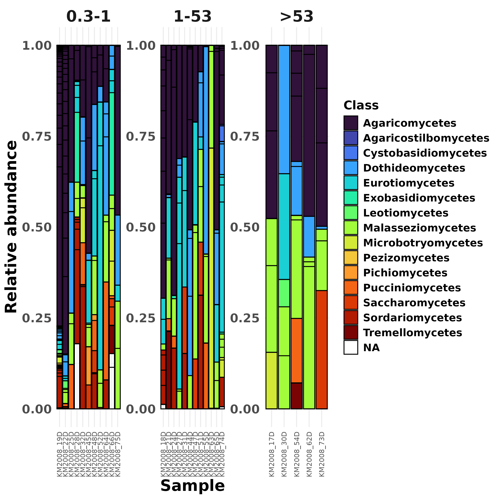
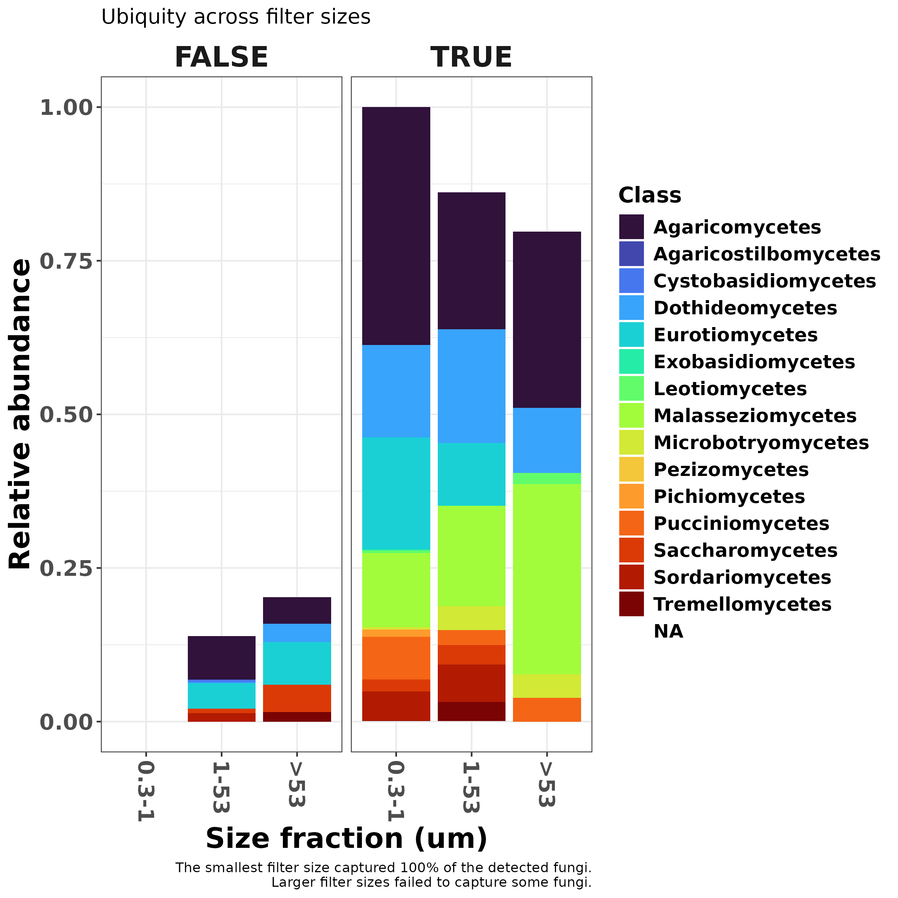
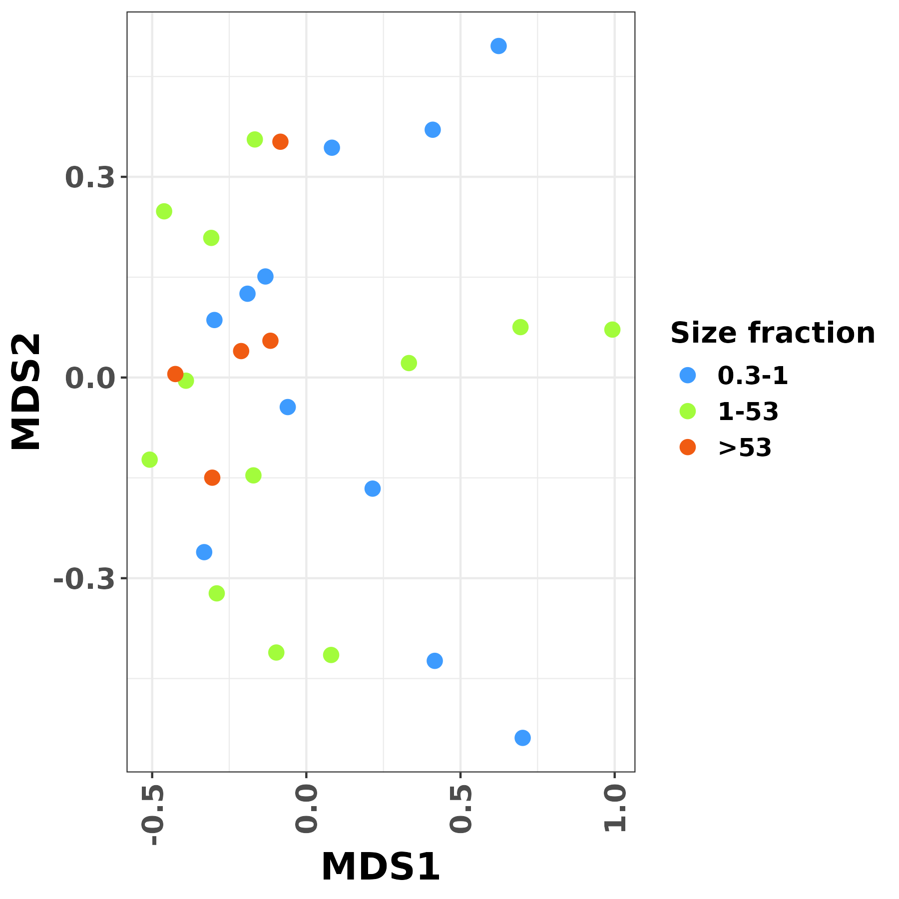
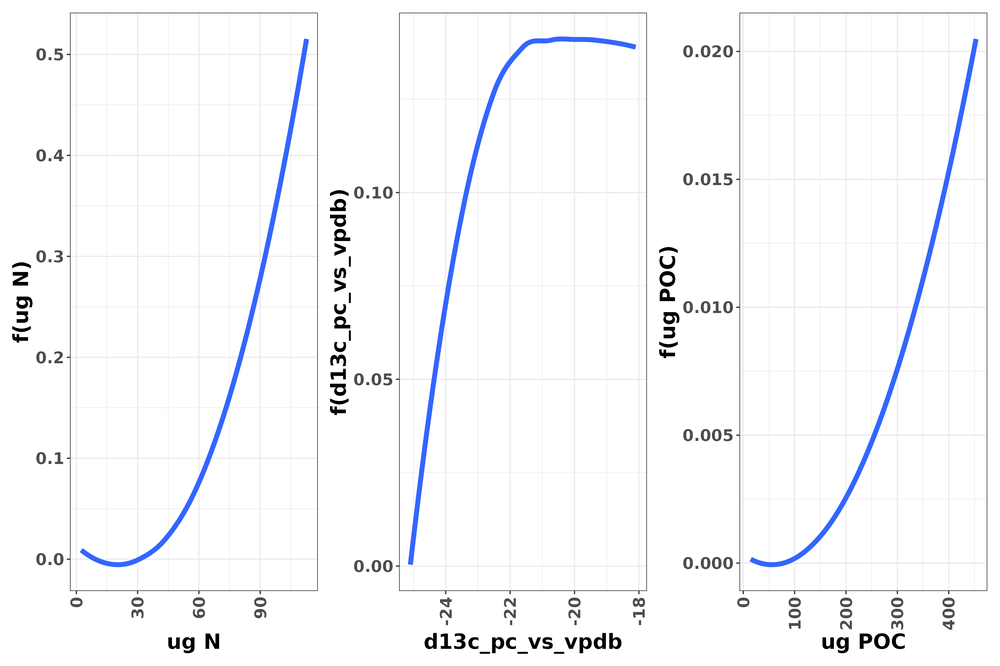

```{r setup, include=FALSE}
knitr::opts_chunk$set(echo = FALSE, warning = FALSE,message = FALSE)
library(tidyverse)
library(kableExtra)
```

```{r primers}
# primer sequences
its1f <- "CTTGGTCATTTAGAGGAAGTAA"
its2 <- "GCTGCGTTCTTCATCGATGC"
# ssu
SSU_18S82F <- "GAAACTGCGAATGGCTC"
SSU_Ek516R <- "ACCAGACTTGCCCTCC"
# LSU 
LSU_ITS4ngsF <- "GCATATCAATAAGCGSAGGA"
LSU_LF402R <- "TTCCCTTTYARCAATTTCAC"

region <- c(rep(c("ITS1","SSU","LSU"),each=2))
primer <- c("its1f","its2","SSU_18S82F","SSU_Ek516R","LSU_LF402R","LSU_ITS4ngsF")
seq <- c(its1f,its2,SSU_18S82F,SSU_Ek516R,LSU_LF402R,LSU_ITS4ngsF)
primer_df <- data.frame(region,primer,seq)

```


# METHODS ####

## Quality Control ####

**Primer sequences**
```{r}
kable(primer_df) %>% kable_classic()
?dada2::mergePairs()
```

```./R/01_Trim_Primers.R```

Primers were removed using cutadapt version 3.5 (Martin, 2011) with Python version 3.10.12, and any sequences shorter than 100 nt were removed. ITS1 reads had flanking 18S regions removed using ITSxpress (Rivers, *et al.*, 2018).


## ASV Calling ####

```./R/02_Build_ASV_Tables.R```

Trimmed reads were processed for ASV inferrence using DADA2 (Callahan, *et al.*, 2016) as follows:

  1. ITS1
    - Only forward reads used
    - Max EE = 2
    - Truncated at 3' end when quality score dropped (Q=2)
    - Chimeras removed using *de novo* detection (DADA2)
  2. SSU
    - Same as ITS1, but forward and reverse reads used
    - Fwd and Rev reads merged using DADA2 with minimum overlap of 12 bp and max mismatch of 0
  3. LSU
    - Same as SSU

Denoised ASVs were used for all downstream steps.

## Taxonomic Assignment ####

```.R/03_Assign_Taxonomy.R```

ASVs were assigned taxonomy using the RDP Naive Bayesian Classifier algorithm (Wang, *et al.*, 2007) against the respective ITS, SSU, and LSU EUKARYOME databases (version 1.8) (Tedersoo *et al.*, 2024). After initial checking of the taxonomic composition of all amplicon data sets, ASVs not unambiguously assigned to a fungal phylum were removed from analyses. Finally, ASVs from all 3 amplicons were additively collapsed at the species-level.

## Stats ####

For statistical inferences collectively based on all 3 amplicons, abundance data was transformed to presence-absence to account for any differential taxonomic affiliations of the primer sets.

Generalized Dissimilarity Models were performed using the gdm R package version 1.6 (Fitzpatrick, *et al.*, 2024).

Community distance matrices were calculated using Jaccard distances in the vegan R package version 2.6.6.1 (Okansen *et al.*, 2024)

___


# RESULTS ####

## Amplicon differences ####

The three amplicon methods yielded differences in overall co-amplification on non-fungi. ITS1 primers co-amplified a lot of metazoan sequences, while LSU and SSU primers co-amplified more "mitochondrial" sequences and Stramenophiles. The SSU primers additionally co-amplified a lot of Alveolates.

```{r}

```

___

## Alpha Diversity ####

**ASV stats:**
```{r}
x <- readRDS("./output/ASV_Stats.RDS")
y <- readRDS("./output/fungal_species_full_phyloseq_object.RDS")
```
A total of `r x$N_ASVs` ASVs were detected in `r x$N_Samples` samples overall. Of these, `r x$N_Fungal_ASVs` ASVs were unambiguously assigned to fungi. These fungal ASVs represented `r phyloseq::ntaxa(y)` fungal species.

**Overview of fungal alpha diversity by size class:**
```{r}

```

**Fungal richness was not significantly correlated to size class or sampling depth.**
```{r}
readRDS("./output/alpha_div_glm_table.RDS") %>% 
  kable() %>% kable_classic()
```

However, while the minimum filter size captured 100% of all detected fungi, the larger filter sizes failed to capture some fungal taxa that were detected in the smallest (0.3-1 um) filter.
```{r}

```

___

## Beta diversity ####

**NMDS Ordination Plot**
```{r}

```

**Filter size did not significantly impact fungal community structure**
```{r}
readRDS("./output/PermANOVA_Fungal_Community_vs_SizeClass.RDS") %>% 
  mutate(term = term %>% str_remove("x@sam_data\\$")) %>% 
  kable() %>% kable_classic()
```


**Three environmental variables affected community structure.**

Generalized dissimilarity models showed partial community distances affected by N, d13c_pc_vs_vpdb, and POC.
```{r}

```
While the effect of d13c_pc_vs_vpdb on community distance was saturated at ~ -22, N and POC had increasing (and no plateau) effects on fungal communities with increasing concentrations.

```{r}

```

___

# REFERENCES ####

Callahan, B. J., McMurdie, P. J., Rosen, M. J., Han, A. W., Johnson, A. J. A., & Holmes, S. P. (2016). DADA2: High-resolution sample inference from Illumina amplicon data. Nature Methods, 13(7), 581–583. https://doi.org/10.1038/nmeth.3869

Fitzpatrick MC, Mokany K, Manion G, Nieto-Lugilde D, Ferrier S. (2024) gdm: Generalized Dissimilarity Modeling. R package version 1.6.

Martin, M. (2011). Cutadapt removes adapter sequences from high-throughput sequencing reads. EMBnet.Journal, 17(1), 10–12. https://doi.org/10.14806/ej.17.1.200

Oksanen J, Simpson G, Blanchet F, Kindt R, Legendre P, Minchin P, O'Hara R, Solymos P, Stevens M, Szoecs E, Wagner H, Barbour M, Bedward M, Bolker B, Borcard D, Carvalho G, Chirico M, De Caceres M, Durand S, Evangelista H, FitzJohn R, Friendly M, Furneaux B, Hannigan G, Hill M, Lahti L, McGlinn D, Ouellette M, Ribeiro Cunha E, Smith T, Stier A, Ter Braak C, Weedon J (2024). _vegan: Community Ecology Package_. R package version 2.6-6.1
  
Tedersoo, L., Hosseyni Moghaddam, M. S., Mikryukov, V., Hakimzadeh, A., Bahram, M., Nilsson, R. H., Yatsiuk, I., Geisen, S., Schwelm, A., Piwosz, K., Prous, M., Sildever, S., Chmolowska, D., Rueckert, S., Skaloud, P., Laas, P., Tines, M., Jung, J.-H., Choi, J. H., … Anslan, S. (2024). EUKARYOME: The rRNA gene reference database for identification of all eukaryotes. Database, 2024, baae043. https://doi.org/10.1093/database/baae043

Rivers, A. R., Weber, K. C., Gardner, T. G., Liu, S., & Armstrong, S. D. (2018). ITSxpress: Software to rapidly trim internally transcribed spacer sequences with quality scores for marker gene analysis. F1000Research, 7, 1418. https://doi.org/10.12688/f1000research.15704.1

Wang, Q., Garrity, G. M., Tiedje, J. M., & Cole, J. R. (2007). Naive Bayesian classifier for rapid assignment of rRNA sequences into the new bacterial taxonomy. Applied and Environmental Microbiology, 73(16), 5261–5267. https://doi.org/10.1128/AEM.00062-07


